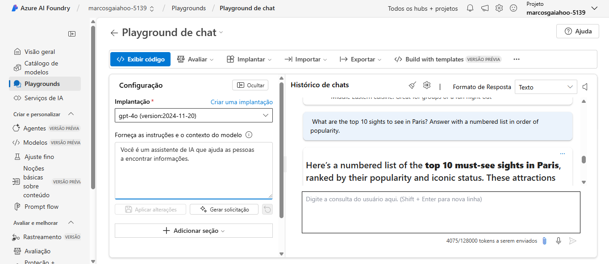
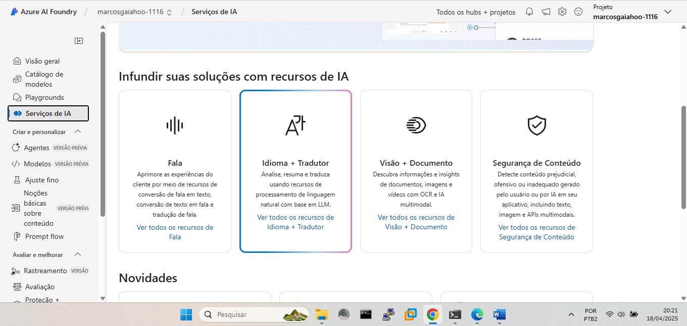
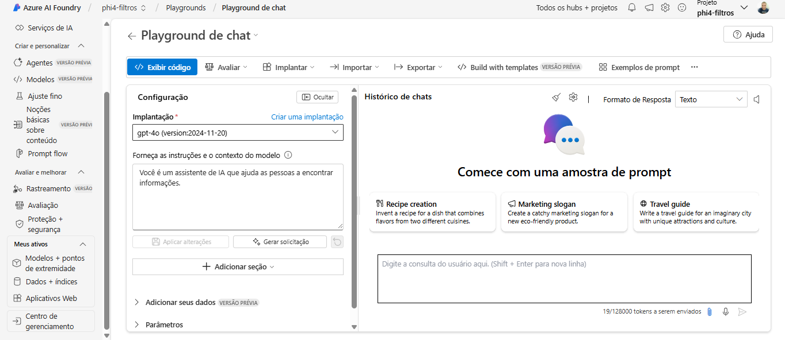
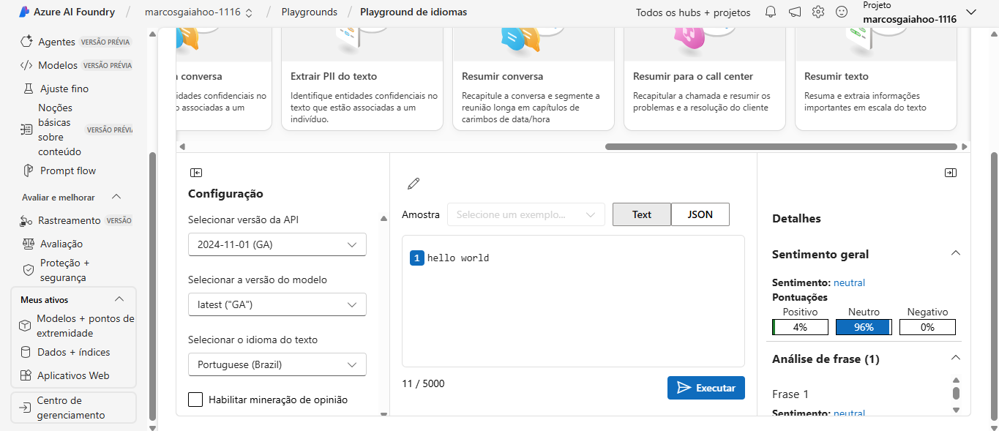
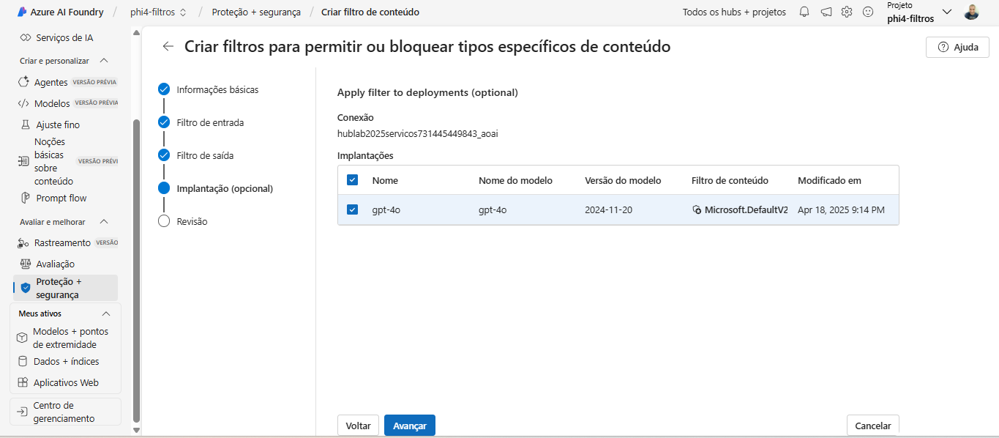

#  Desafios Microsoft Learn — Azure AI Studio e Fundamentos de IA Generativa

> Documentação dos laboratórios práticos com foco em IA generativa no **Azure AI Foundry**.

---

##  Desafios realizados

| Desafio | Descrição | Status |
|--------|----------|--------|
| 01 | Explorar o Azure AI Studio | ✅ Concluído |
| 02 | Compreensão de conteúdo e tradução | ✅ Concluído |
| 03 | Filtros de conteúdo e segurança | ✅ Concluído |

---

## 🖼 Capturas de tela

Abaixo estão algumas imagens extraídas diretamente do ambiente do Azure AI Studio:

### Criar projeto

### Tela do filtro de conteúdo

### Resultado com bloqueio de conteúdo

### Tradução de texto

### Playground IA

---

##  Arquivos incluídos

- `AI Foundry Portal.docx` → Documento completo com as evidências
- `prints/` → Imagens extraídas do portal Azure
- `README.md` → Este arquivo

---

##  Base dos exercícios

- [Explore o Azure AI Studio](https://microsoftlearning.github.io/mslearn-ai-studio/Instructions/01-Explore-ai-studio.html)
- [Tradução e compreensão de conteúdo](https://microsoftlearning.github.io/mslearn-ai-studio/Instructions/06-Explore-content-filters.html)
- [Fundamentos da IA generativa](https://microsoftlearning.github.io/mslearn-ai-fundamentals/Instructions/Labs/12-generative-ai.html)

---

##  Autor

Marcos Gaia  
[github.com/marcosgaia](https://github.com/marcosgaia)
